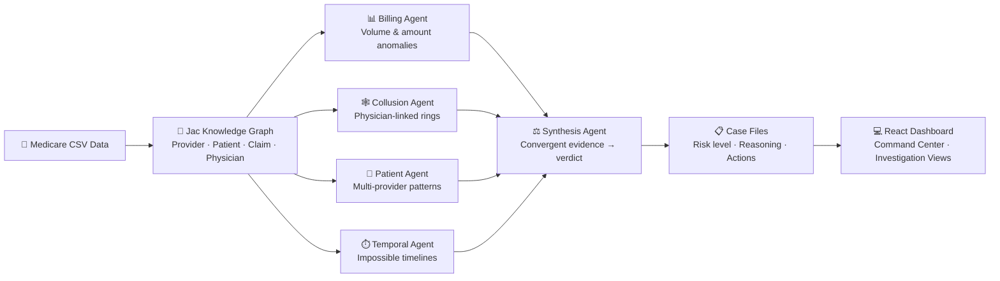

<p align="center">
  
  
  
  
</p>

<h1 align="center">⚖️ Sentinel</h1>
<p align="center"><strong>Multi-Agent Healthcare Fraud Investigation System</strong></p>
<p align="center"><em>5 AI agents. One knowledge graph. Zero wasted investigations.</em></p>
<p align="center">Built at <strong>JacHacks 2026</strong> · Fintech Track</p>

---

## The Problem

Medicare fraud costs the U.S. healthcare system **over $100 billion annually**. Existing detection systems produce a score — Sentinel produces an **investigation**. Our multi-agent system walks a Medicare claims knowledge graph from different angles, requiring convergent evidence before flagging fraud.

## How It Works



### Agent Pipeline

| Agent | What It Detects | Graph Path |
|---|---|---|
| **Billing Volume** | Claim count & dollar amount anomalies vs peer cohort | `Provider → Claims` |
| **Collusion Network** | Physicians shared across multiple providers with high dollar flow | `Provider → Claim → Physician` |
| **Patient Pattern** | Multi-provider patients, post-death claims, high-volume beneficiaries | `Patient → Claim → Provider` |
| **Temporal Anomaly** | Overlapping hospital stays, claim bursts, patient shuttling | `Claim → Date dimension` |
| **Synthesis** | Cross-agent convergence — requires 2+ agents to agree for HIGH risk | `All agent outputs` |

### Key Design Decision

> The Synthesis Agent requires **corroborating evidence** from multiple specialist agents before escalating to HIGH risk. A single agent signal = MEDIUM. This drives precision to **98%** — nearly zero wasted investigator hours.

## Tech Stack

| Layer | Technology |
|---|---|
| **Core Pipeline** | **Jac** — graph schema, walkers, agents, byLLM integration |
| **Data Ingestion** | Python — CSV parsing, graph-ready data preparation |
| **Frontend** | React 19 + Framer Motion + D3.js |
| **AI Chat** | OpenAI GPT-4o-mini (streaming SSE) |
| **Server** | Express 5 + Multer (file upload) |
| **Visualization** | D3.js force-directed graphs (background + investigation) |

## Results (200-Provider Sample, Jac-generated)

| Metric | Value |
|---|---|
| Providers scanned | 200 |
| Case files generated | 104 |
| HIGH risk flagged | 40 |
| MEDIUM risk flagged | 64 |
| Collusion rings detected | 8 |
| Temporal anomalies | 4 |
| Estimated fraud exposure | **$50.6M** |
| Precision (HIGH risk) | **98%** |

> Results produced by running `jac run src/agents/synthesis_agent.jac` on the CMS Medicare training dataset.

## Quick Start

```bash
# 1. Clone the repo
git clone https://github.com/Yxp23/Sentinel.git
cd Sentinel

# 2. Install frontend dependencies
cd frontend
npm install

# 3. Set your OpenAI API key
export OPENAI_API_KEY=sk-...

# 4. Build and start the server
npm run build:start

# 5. Open http://localhost:3002
```

### Run the Jac Pipeline

```bash
# Run all 5 agents on the default dataset (produces output/results.json)
jac run src/agents/synthesis_agent.jac

# Or upload your own Medicare CSV files via the web UI
# Requires: Beneficiary CSV, Inpatient CSV, Outpatient CSV
```

### Environment Variables

```bash
OPENAI_API_KEY=sk-...   # Required for the Sentinel AI chat assistant
```

## Project Structure

```
Sentinel/
├── src/
│   ├── graph/
│   │   └── schema.jac              # Knowledge graph: Provider, Patient, Claim, Physician
│   ├── agents/
│   │   ├── billing_volume_agent.jac # Billing anomaly detection agent
│   │   ├── billing_walker.jac       # Walker: peer-relative volume analysis
│   │   ├── collusion_agent.jac      # Collusion ring detection agent
│   │   ├── collusion_walker.jac     # Walker: physician network mapping
│   │   ├── patient_agent.jac        # Patient pattern detection agent
│   │   ├── patient_walker.jac       # Walker: multi-provider abuse patterns
│   │   ├── temporal_agent.jac       # Temporal anomaly detection agent
│   │   ├── temporal_walker.jac      # Walker: impossible timeline detection
│   │   └── synthesis_agent.jac      # Orchestrator: runs all agents, builds case files
│   ├── loader/
│   │   └── load_data.py             # CSV ingestion + graph-ready data preparation
│   └── api/
│       ├── run_agents.py            # Fast-path for real-time uploads (~45s)
│       └── export_results.py        # Results export utility
├── frontend/
│   ├── src/components/              # React components
│   ├── server.js                    # Express server: API + SSE streaming + chat
│   └── package.json
├── output/
│   └── results.json                 # Pre-computed case files (from jac run)
├── jac.toml                         # Jac configuration + byLLM model settings
└── README.md
```

## License

Built for JacHacks 2026. All rights reserved.
